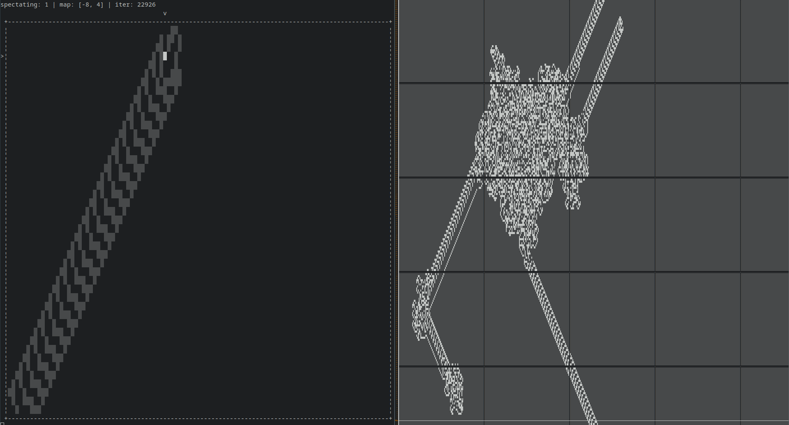
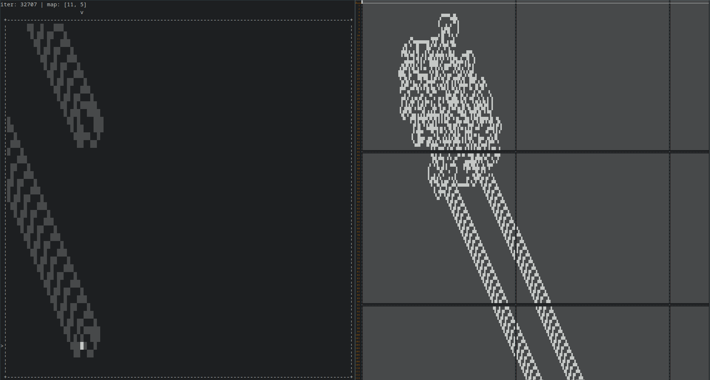
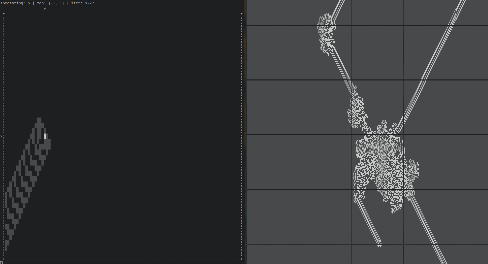
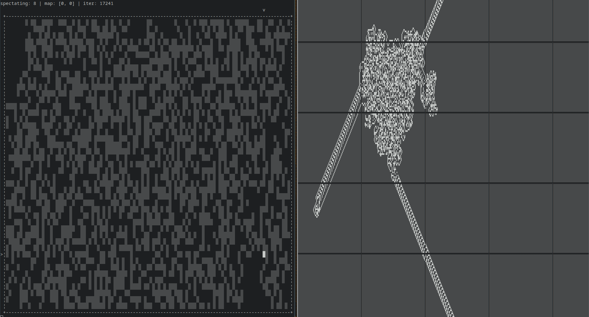

# pyAnt
CLI Langton's Ant to fill terminal windows. Written in python

[](https://www.gnu.org/licenses/gpl-3.0)




ToC:
- [pyAnt](#pyant)
- [Installation](#installation)
  - [Windows](#windows)
  - [Linux](#linux)
- [Usage](#usage)
- [TODO](#todo)
- [Gallery](#gallery)

# Installation

Get the latest version of [python](https://www.python.org/).

Save `ant.py` to your machine

## Windows

`ant.py` can now be run by clicking or through use of the command line.

## Linux

Make the file executable:
```
chmod u+x ant.py
```

Optionally,
place it in your `bin` folder and remove the `.py` extension to cleanly run it anywhere:
```
sudo cp ant.py /usr/bin/ant
```

# Usage
Double click the file or run it from a terminal window.

To stop the game from running, press `ctrl+c` or forcibly close the window.

```
ant.py [-h] [-d DELAY] [-si SKIP_ITERATIONS] [-f FILE] [-cs [1-10]]
              [-ss [0,1000]]

  -h, --help            show this help message and exit
  -d DELAY, --delay DELAY
                        Seconds between iterations. Default: 0.1125
  -si SKIP_ITERATIONS, --skip-iterations SKIP_ITERATIONS
                        Iterations to skip before displaying the ant. Default:
                        0
  -f FILE, --file FILE  Filename of file showing the final generated path.
                        Make blank ("") to have no output. Default:
                        "antmap.txt"
  -cs [1-10], --colony-size [1-10]
                        Number of ants deployed. Default: 1
  -ss [0,1000], --spectator-switch [0,1000]
                        number of iterations before switching which ant is
                        spectated. 0 to disable. Default: 0.
```

# TODO
- [x] infinite space for ant movement
- [x] iteration skipping
- [x] file output of final map
- [x] multiple ants
- [x] periodic automatic switching of spectated ant
- [ ] reduce elif chains
- [ ] manual switching of spectated ant
  - may be done with events
- [ ] saving maps to file and loading from memory
  - may allow pausing, saving, and resuming of ant simultions

# Gallery



